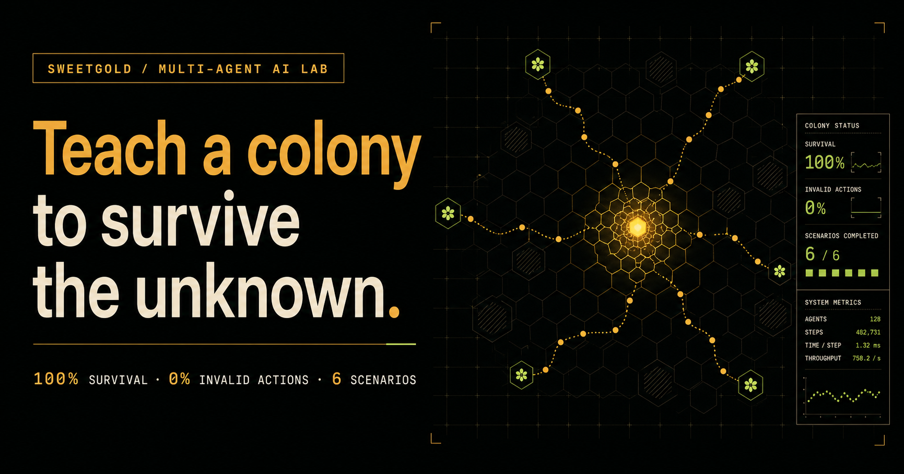

# SweetGold

[English](README.md) | [简体中文](README.zh-CN.md)

<p align="center"></p>

<p align="center"><strong>一个让策略用证据赢得晋级的可复现多智能体 AI 实验室。</strong></p>

SweetGold 同时是确定性蜂群模拟器（deterministic simulation）、配对种子基准
（matched-seed benchmark）和交互式策略竞技场（Strategy Arena）。它支持行为克隆
（Behavior Cloning）、PPO 和 CTDE，并强制隔离训练、验证和测试种子。模型只有通过
预先声明的质量与安全门槛才能晋级；失败实验不会被删除或事后改标准。

## 最新完成成果：M15

M15 是当前项目阶段。它没有继续训练新策略，而是把 Arena 证据转化成明确、可审计的策略决策。

| M15 工作流能力 | 已交付结果 |
| --- | --- |
| 决策目标 | `balanced`（平衡）、`yield`（产量）、`safety`（安全） |
| 安全约束 | 最低蜜蜂存活率和最大无效动作率 |
| 决策行为 | 确定性推荐，或明确返回“没有合格策略” |
| 决策证据 | 链接 Arena 原始产物，同时输出机器可读 JSON 和人类可读 Markdown |

M15 第一阶段已经进入 `main`；项目目前暂停新特性开发，转入维护、文档和发布工作。

## 最新晋级策略：M14

M15 负责从已有策略中做选择，不会改变蜜蜂行为。因此，最近一个拥有正式跨分布性能结果的
策略仍然是 M14 `hierarchical-return-ctde`。

| M14 在未使用最终种子上的结果 | 结果 |
| --- | ---: |
| 六种场景中的最低蜜蜂存活率 | **100%** |
| 最大无效动作率 | **0%** |
| 相对 Assignment 的蜂蜜中位数 | **148.47%** |
| 相对 Assignment 的最差场景蜂蜜 | **101.16%** |

> M14 在六种环境分布中各使用 50 个从未参与训练或选型的最终种子。完整范围与方法见
> [M14 模型卡](docs/models/hierarchical-return-ctde.zh-CN.md)和
> [v1.1.0 发布说明](docs/releases/v1.1.0.zh-CN.md)。

遇到新词时可随时查看[中英术语表](docs/glossary.md)。

## 为什么做 SweetGold？

- **同一个世界，不同的思维。** 两个策略从完全相同的世界和随机种子出发，实时比较并逐帧回放。
- **失败也是证据。** M10–M12 没通过鲁棒性门槛，记录被完整保留，并直接推动了 M14 的结构性改变。
- **从结构上保证可复现。** 种子清单、泄漏检查、不可变运行产物、置信区间和 SHA-256 模型校验都属于工作流本身。
- **没有 ML 环境也能运行。** 模拟器、规则策略、基准和网页 Arena 只需要 Python 3.10+，不依赖第三方包。

## 快速开始 / Quick start

```bash
git clone https://github.com/alanthssss/sweetgold.git
cd sweetgold
python3 main.py play --port 8080
```

浏览器打开 <http://127.0.0.1:8080>。生成 30 回合配对种子报告：

```bash
python3 main.py benchmark --episodes 30 --report report
```

列出、下载和校验已晋级模型：

```bash
python3 main.py models list
python3 main.py models download
python3 main.py models verify
```

运行 M15 可审计建议：

```bash
python3 main.py arena-agent \
  --strategies assignment greedy scout \
  --objective balanced \
  --min-bee-survival 0.9 \
  --max-invalid-action-rate 0.01 \
  --episodes 10 --seed 42
```

小规模联赛只是工作流演示，不能替代正式的跨分布鲁棒性审计。

## 三个产品部分

### BeeSim：蜂群模拟器

世界由地形矩阵、可再生花丛、蜂巢、蜜蜂和可复现的随机天气构成。每只蜜蜂每一步可
选择移动、采集、存蜜、休息或发信号。`BeeEnv.observe()` 输出 JSON 兼容状态，
`BeeEnv.step()` 接受“蜜蜂 ID → 动作”的映射，因此学习算法不需要改动环境核心。

### BeeBench：配对种子评测

多个控制器在相同回合种子上接受评测，报告蜂蜜、群体和个体存活率、能量效率、覆盖率、
死亡数、无效动作率与决策延迟。内置 `random`、`greedy`、`scout` 和集中式
`assignment` 基线，并提供配对置信区间。

### Strategy Arena：策略竞技场

Arena 从注册表发现规则策略和已晋级模型，验证模型 SHA-256 后才允许加载。两个策略从
相同世界出发，实时显示差值并保存每一帧。联赛（league）在共享种子集合上循环对战；
M15 再把联赛证据转化为带目标、约束、淘汰原因和源产物链接的建议。

## 学习与审计路线

| 里程碑 | 内容与结果 |
| --- | --- |
| M2–M3 | 建立 Assignment 确定性基线，并改善动态编队能效。 |
| M4 | 行为克隆 + DAgger；测试集达到教师蜂蜜的 97%。 |
| M5–M6 | 从 BC 初始化 PPO，并建立端到端实验、选型和晋级流水线。 |
| M7 | 局部观察 CTDE 显著优于局部 BC，但 1.056% 无效动作超过 1% 门槛，因此拒绝。 |
| M8 | 本地意图广播和轮换优先级解决资源争用；候选通过门槛并进入注册表。 |
| M9 | Strategy Arena 支持同种子并排执行、指标和回放。 |
| M10 | 首次跨分布审计失败：稀缺花蜜产量和恶劣天气存活率不达标。 |
| M11 | 顺序课程训练失败；恶劣天气存活率仍只有 6.5%。 |
| M12 | 交错课程将恶劣天气存活率提高到 27.75%，但仍未通过 75% 门槛。 |
| M13 | 模型元数据和大文件分离；支持不可变下载地址、大小、许可证与 SHA-256 校验。 |
| M14 | 加入“觅食、返航、存蜜、充能”高层监督器；六种最终场景全部通过。 |
| M15 | 可审计智能体工作流：明确目标和安全约束，输出机器与人类可读决策证据。 |

## 可选 ML 流水线

学习功能需要 `requirements-ml.txt` 中的 PyTorch 依赖。完整命令和参数保留在
[英文 README](README.md) 对应章节；所有正式流水线都会在运行前展开并检查种子集合，
阻止训练、内部验证、模型选择和最终测试之间的泄漏。生成的数据集、权重和运行目录不进入 Git。

关键入口：

```bash
.venv-ml/bin/python main.py pipeline --config experiments/m6-bc-ppo.json
.venv-ml/bin/python main.py pipeline-m7 --config experiments/m7-ctde.json
.venv-ml/bin/python main.py pipeline-m8 --config experiments/m8-coordination.json
.venv-ml/bin/python main.py pipeline-m10 --config experiments/m10-robustness.json
.venv-ml/bin/python main.py pipeline-m11 --config experiments/m11-curriculum.json
.venv-ml/bin/python main.py pipeline-m12 --config experiments/m12-interleaved.json
.venv-ml/bin/python main.py pipeline-m14 --config experiments/m14-hierarchical-return.json
```

## 文档导航

- [产品与研究设计](docs/product-design.zh-CN.md)
- [模型卡目录](docs/models/README.zh-CN.md)
- [发布说明](docs/releases/v1.1.0.zh-CN.md)
- [贡献指南](CONTRIBUTING.zh-CN.md)
- [维护模式](MAINTENANCE.zh-CN.md)
- [安全策略](SECURITY.zh-CN.md)
- [中英术语表](docs/glossary.md)

## 许可证

SweetGold 源代码使用 [Apache License 2.0](LICENSE)。单独分发的模型和数据集可能有各自条款。
